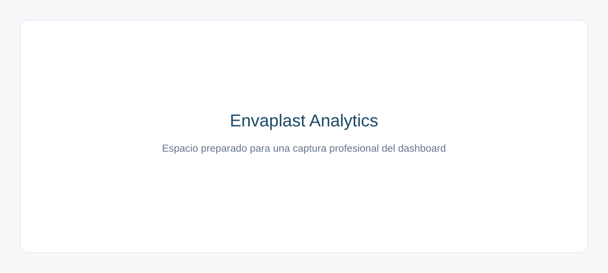

# Envaplast Analytics

Aplicación de business intelligence para una fabricante argentina ficticia de envases plásticos. El proyecto reproduce un circuito comercial completo —pedido, entrega, factura y cobranza— y lo transforma en información gerencial accionable.

> **Aviso:** Envaplast, sus clientes, CUIT, documentos y operaciones son totalmente sintéticos. No representan personas ni empresas reales.

## Qué demuestra

- Modelado relacional y SQL compatible con SQLite/PostgreSQL.
- Generación reproducible de 18 meses de datos con estacionalidad y concentración comercial.
- ETL incremental idempotente, trazabilidad y controles automáticos.
- KPIs comerciales, cuentas corrientes, mora y análisis ABC.
- Aplicación Streamlit profesional, filtros, visualizaciones y descargas.

## Vistas del MVP

1. **Resumen ejecutivo:** facturación comparable, unidades, pedidos, cartera, mora y alertas.
2. **Facturación y ventas:** tendencias y mix por producto, cliente y geografía.
3. **Pedidos:** backlog, estados, demoras y cumplimiento prometido.
4. **Cuentas corrientes:** saldos, aging, vencidos, concentración y límites.
5. **Clientes y ABC:** participación móvil de 12 meses y evolución individual.



## Arquitectura

```text
Generador Python / GitHub Actions
              │
              ▼
 SQLite local ─── SQLAlchemy ─── PostgreSQL/Supabase
              │
              ▼
     Servicios de métricas
              │
              ▼
        Streamlit + Plotly
```

La decisión completa está en [docs/architecture.md](docs/architecture.md) y el modelo en [docs/data-model.md](docs/data-model.md).

## Instalación local

Requiere Python 3.12.

```powershell
python -m venv .venv
.venv\Scripts\Activate.ps1
python -m pip install -e ".[dev]"
Copy-Item .env.example .env
python scripts/init_db.py --months 18
streamlit run app/app.py
```

La aplicación queda disponible normalmente en `http://localhost:8501`. Si la base no existe, la aplicación crea automáticamente una demostración local.

## Operación y calidad

```powershell
# Fecha específica; repetirla no duplica registros
python scripts/generate_daily.py --date 2026-07-20

# Completar huecos hasta hoy
python scripts/generate_daily.py --fill-missing

# Calidad, tests y lint
python scripts/validate_data.py
pytest
ruff check .
ruff format --check .
```

Cada día usa una semilla derivada de `ENVAPLAST_SEED` y la fecha. `generation_runs.business_date` es único y la carga se confirma en una sola transacción.

## Variables de entorno

| Variable | Uso | Predeterminado |
|---|---|---|
| `DATABASE_URL` | URL SQLAlchemy de SQLite o PostgreSQL | `sqlite:///data/envaplast.db` |
| `ENVAPLAST_SEED` | Semilla reproducible | `20260720` |
| `ENVAPLAST_ENV` | Nombre del entorno | `development` |

Nunca se deben versionar `.env`, `secrets.toml` ni credenciales. Para PostgreSQL se recomienda `postgresql+psycopg://...`.

## Automatización y despliegue

El workflow `.github/workflows/daily-data.yml` se ejecuta diariamente o manualmente, exige `DATABASE_URL`, completa fechas faltantes y detiene el proceso si falla calidad o tests. La guía para Supabase y Streamlit Community Cloud está en [docs/deployment.md](docs/deployment.md). No se crean recursos externos automáticamente.

### Publicación rápida del portfolio

El repositorio está preparado para desplegarse directamente en Streamlit Community Cloud:

1. Publicar la rama `main` en GitHub.
2. Crear una aplicación en `share.streamlit.io`.
3. Seleccionar `app/app.py` como archivo principal y Python 3.12.
4. Para una demo sin credenciales, no configurar secretos: la aplicación generará una SQLite sintética en el primer arranque.
5. Para persistencia diaria, configurar `DATABASE_URL` con PostgreSQL/Supabase en los secretos de Streamlit y GitHub Actions.

La SQLite del modo demostración puede regenerarse después de una suspensión o reinicio del contenedor. Esto no modifica las métricas esperadas porque el generador es reproducible.

## KPIs

Las definiciones formales están en [docs/kpi-definitions.md](docs/kpi-definitions.md). La comparación mensual usa el mismo número de días transcurridos; ABC usa facturación de los últimos 365 días con cortes acumulados 80/95%; cartera es factura menos cobranzas.

## Competencias y aprendizajes

El proyecto integra análisis de negocio, diseño de datos, SQL, Python, automatización, QA, visualización y comunicación ejecutiva en un producto reproducible. La separación entre persistencia, lógica y presentación permite evolucionar el MVP sin reescribirlo.

## Roadmap

Finanzas y proveedores, compras/producción/stock, costos e inflación, y activos de comunicación para portfolio están detallados en [docs/roadmap.md](docs/roadmap.md).
