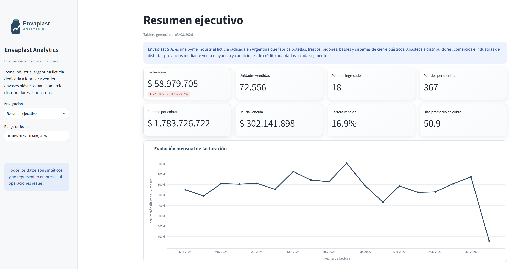

# 📊 Envaplast Analytics

> **Transformando datos comerciales en decisiones de negocio.**

**[🚀 Ver demo en vivo](https://envaplast-analytics.streamlit.app/)**

Envaplast Analytics es un producto de datos desarrollado para demostrar cómo una PyME puede transformar información dispersa en una herramienta de gestión moderna.

El proyecto reproduce el circuito comercial completo —desde el pedido hasta la cobranza— y lo convierte en una aplicación de Business Intelligence capaz de responder preguntas de negocio mediante indicadores claros, procesos automatizados y visualizaciones ejecutivas.

> **Aviso:** Envaplast, sus clientes, CUIT, documentos y operaciones son totalmente sintéticos. No representan personas ni empresas reales.

## ¿Por qué construí este proyecto?

Muchas PyMEs toman decisiones con información distribuida entre planillas, reportes y sistemas desconectados. Envaplast Analytics demuestra cómo transformar ese escenario en un producto de datos moderno: integrado, reproducible y orientado a responder preguntas concretas del negocio.

Envaplast es una empresa ficticia, pero el problema de negocio que representa es real y frecuente en organizaciones que necesitan convertir datos dispersos en información confiable para decidir.

## 🎯 El problema

En muchas pequeñas y medianas empresas la información comercial existe, pero se encuentra distribuida entre planillas, reportes y distintos sistemas.

Responder preguntas simples suele requerir tiempo y trabajo manual:

- ¿Cómo evolucionan las ventas?
- ¿Qué clientes generan mayor facturación?
- ¿Cuánto dinero está pendiente de cobro?
- ¿Cómo evoluciona la cartera?
- ¿Qué pedidos presentan demoras?

Envaplast Analytics centraliza esa información y la transforma en una herramienta que permite responder esas preguntas en segundos.

## 🚀 Capacidades del proyecto

- Modelado relacional y SQL compatible con SQLite/PostgreSQL.
- Generación reproducible de 18 meses de datos con estacionalidad y concentración comercial.
- ETL incremental idempotente, trazabilidad y controles automáticos.
- KPIs comerciales, cuentas corrientes, mora y análisis ABC.
- Aplicación Streamlit profesional, filtros, visualizaciones y descargas.

## Vistas del MVP

1. **Resumen ejecutivo:** facturación comparable, unidades, pedidos, cartera, mora y alertas.
2. **Facturación y ventas:** tendencias y mix por producto, cliente y geografía.
3. **Pedidos:** backlog, estados, demoras y cumplimiento prometido.
4. **Cuentas corrientes:** saldos, aging, vencidos, concentración y límites.
5. **Clientes y ABC:** participación móvil de 12 meses y evolución individual.

## 🖥️ Vista del producto



## 💡 Mi enfoque

Este proyecto no fue diseñado pensando únicamente en construir un dashboard.

El objetivo fue desarrollar un producto de datos que reprodujera un escenario real de negocio, integrando generación de datos, modelado, automatización, validación y visualización.

Mi forma de trabajar parte siempre de las preguntas del negocio antes que de las herramientas.

## ¿Qué demuestra este proyecto?

- Comprensión de problemas de negocio.
- Modelado relacional y SQL.
- Desarrollo de procesos ETL reproducibles.
- Automatización e idempotencia.
- Validación y calidad de datos.
- Diseño de indicadores comerciales y financieros.
- Desarrollo de dashboards ejecutivos.
- Documentación técnica y comunicación de resultados.

## Arquitectura

```text
Generador Python / GitHub Actions
              │
              ▼
 SQLite local ─── SQLAlchemy ─── PostgreSQL/Supabase
              │
              ▼
     Servicios de métricas
              │
              ▼
        Streamlit + Plotly
```

La decisión completa está en [docs/architecture.md](docs/architecture.md) y el modelo en [docs/data-model.md](docs/data-model.md).

## Instalación local

Requiere Python 3.12.

```powershell
python -m venv .venv
.venv\Scripts\Activate.ps1
python -m pip install -e ".[dev]"
Copy-Item .env.example .env
python scripts/init_db.py --months 18
streamlit run app/app.py
```

La aplicación queda disponible normalmente en `http://localhost:8501`. Si la base no existe, la aplicación crea automáticamente una demostración local.

## Operación y calidad

```powershell
# Fecha específica; repetirla no duplica registros
python scripts/generate_daily.py --date 2026-07-20

# Completar huecos hasta hoy
python scripts/generate_daily.py --fill-missing

# Calidad, tests y lint
python scripts/validate_data.py
pytest
ruff check .
ruff format --check .
```

Cada día usa una semilla derivada de `ENVAPLAST_SEED` y la fecha. `generation_runs.business_date` es único y la carga se confirma en una sola transacción.

## Variables de entorno

| Variable | Uso | Predeterminado |
|---|---|---|
| `DATABASE_URL` | URL SQLAlchemy de SQLite o PostgreSQL | `sqlite:///data/envaplast.db` |
| `ENVAPLAST_SEED` | Semilla reproducible | `20260720` |
| `ENVAPLAST_ENV` | Nombre del entorno | `development` |

Nunca se deben versionar `.env`, `secrets.toml` ni credenciales. Para PostgreSQL se recomienda `postgresql+psycopg://...`.

## Automatización y despliegue

El workflow `.github/workflows/daily-data.yml` se ejecuta diariamente o manualmente, exige `DATABASE_URL`, completa fechas faltantes y detiene el proceso si falla calidad o tests. La guía para Supabase y Streamlit Community Cloud está en [docs/deployment.md](docs/deployment.md). No se crean recursos externos automáticamente.

La demo pública está disponible en [envaplast-analytics.streamlit.app](https://envaplast-analytics.streamlit.app/).

### Publicación rápida del portfolio

El repositorio está preparado para desplegarse directamente en Streamlit Community Cloud:

1. Publicar la rama `main` en GitHub.
2. Crear una aplicación en `share.streamlit.io`.
3. Seleccionar `app/app.py` como archivo principal y Python 3.12.
4. Para una demo sin credenciales, no configurar secretos: la aplicación generará una SQLite sintética en el primer arranque.
5. Para persistencia diaria, configurar `DATABASE_URL` con PostgreSQL/Supabase en los secretos de Streamlit y GitHub Actions.

La SQLite del modo demostración puede regenerarse después de una suspensión o reinicio del contenedor. Esto no modifica las métricas esperadas porque el generador es reproducible.

## KPIs

Las definiciones formales están en [docs/kpi-definitions.md](docs/kpi-definitions.md). La comparación mensual usa el mismo número de días transcurridos; ABC usa facturación de los últimos 365 días con cortes acumulados 80/95%; cartera es factura menos cobranzas.

## Roadmap

Finanzas y proveedores, compras/producción/stock, costos e inflación, y activos de comunicación para portfolio están detallados en [docs/roadmap.md](docs/roadmap.md).

## 👨‍💻 Sobre mí

Soy Matías Noero.

Transformo información compleja en herramientas simples que ayudan a comprender el negocio y tomar mejores decisiones.

Actualmente desarrollo proyectos relacionados con:

- Business Intelligence
- Data Analytics
- Automatización de procesos
- Ciencia de Datos
- Oil & Gas Analytics

- GitHub: [github.com/mnoero23](https://github.com/mnoero23)
- LinkedIn: [linkedin.com/in/matias-noero-samper](https://www.linkedin.com/in/matias-noero-samper/)
