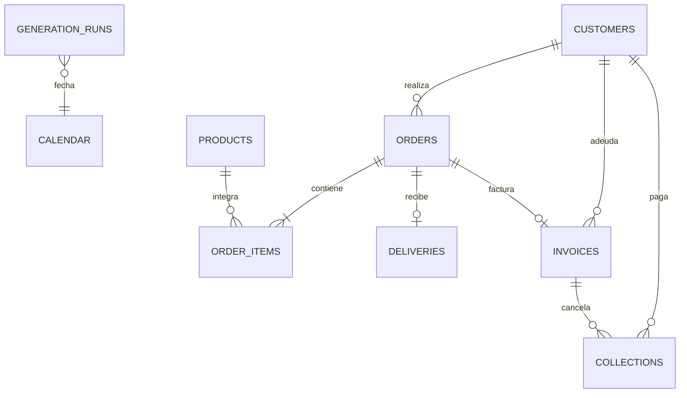

# Modelo de datos

El grano de `order_items` es producto por pedido; el de facturas es una factura por pedido entregado; cobranzas admite varios pagos por factura. `source_key` y `generation_runs.business_date` hacen idempotente la carga. Los estados se restringen con `CHECK`, y fechas, importes e integridad referencial se validan tanto en el esquema como después de cada proceso.

